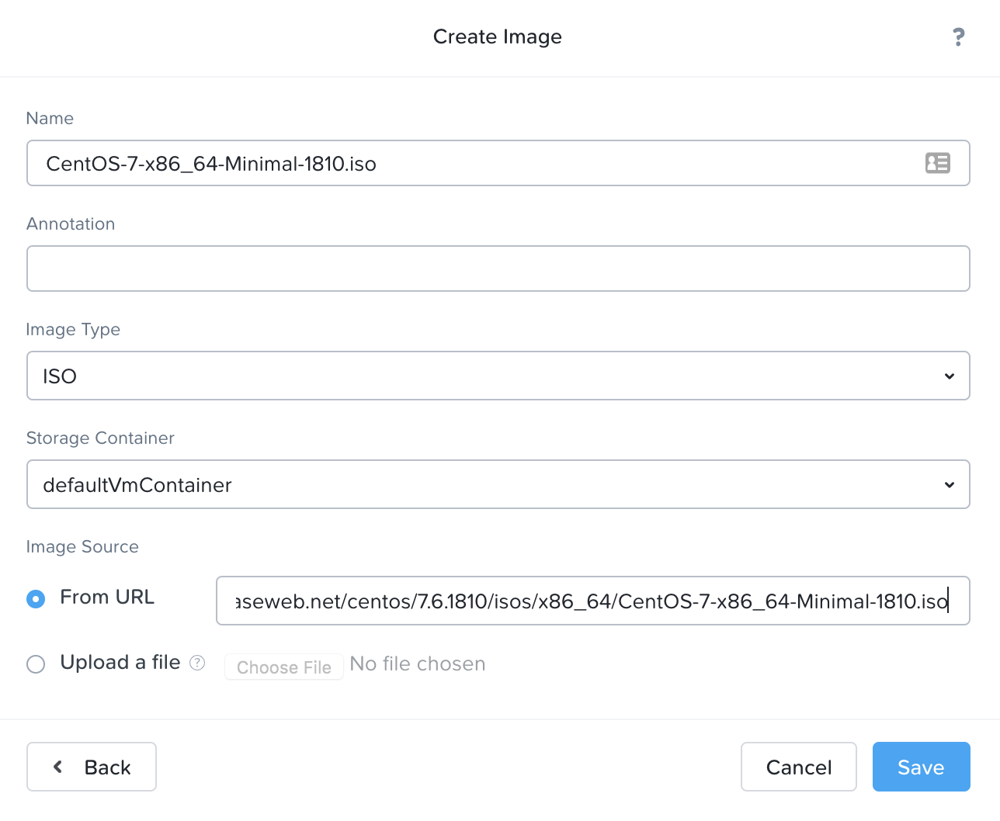
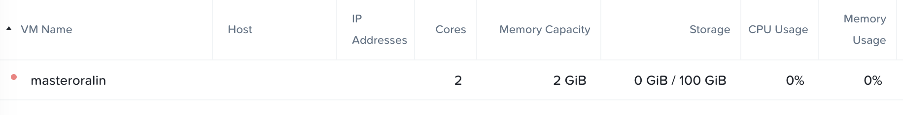

# nutanix-rest-api
Creates consistent VMs via Nutanix REST API calls

## Getting Started

These instructions will get you a copy of the project up and running on your local machine for development and testing purposes.

```
git clone git@github.com:jedioncrk/nutanix-rest-api.git
```

### Prerequisites

What things you need to install the software and how to install them

- Nutanix cluster setup
- Cluster admin bot user
- DNS setup
- Define base image via ISO, preferably with cloud-init enabled (CentOS 7 in my case)
- Define networks in Nutanix

### Define Nutanix Cluster(s)

Enter the hostname of the cluster address of Nutanix as a list under the nutanixcluster variable in group_vars/all.yml.

```
nutanixcluster:
  - <nutanix cluster hostname or IP>
  - <additional nutanix cluster hostname or IP>
```

### Cluster Admin User

Create an admin bot user so that REST API calls can authenticate.  Define these variables:

```
nutanix_username: "nutanixbot"
nutanix_pwd: "nutanix4/u"
```

Encrypt the credentials

```
ansible-vault encrypt vault-password-file.yml
```

### DNS Setup

The playbook does not include DNS setup, therefore depending on your network, this step is manual and differs
from environment to environment.  The playbook is designed to not overlap VMs, therefore if another host is 
running said VM, then the playbook will error out.

### Define Base Image

Upload an ISO to the Nutanix Image.  I used CentOS 7 minimal in this case, but you can use your preferred ISO.



Create a VM and go through a base install of the ISO.  Enable cloud-init and any required modules.
The VM that you create is listed in the VM tables.  Note the name of the VM, which will be used in the next step.



Find the vmdisk's UUID by logging into Nutanix CVM via ssh.

```
ssh nutanixc1 -l nutanixbot
acli vm.disk_get <name of VM>

ide.0 {
  addr {
    bus: "ide"
    index: 0
  }
  cdrom: True
  device_uuid: "7030dbcc-339b-4be8-a48b-63ace9689cf8"
  empty: True
}
scsi.0 {
  addr {
    bus: "scsi"
    index: 0
  }
  container_id: 1275
  container_uuid: "d1a0c2ef-0b76-4447-9497-04fbc9b289fe"
  device_uuid: "83a09138-7a78-44da-913a-1fb6918bc360"
  naa_id: "naa.6506b8d9093b1f52fee794d7667b54d0"
  source_nfs_path: "/defaultVmContainer/.snapshot/52/1980661114838574132-1556753598339014-52/.acropolis/vmdisk/f1947d8e-6965-4ef7-b70d-cc2cab3cc5e7"
  vmdisk_size: 107374182400
  vmdisk_uuid: "f1947d8e-6965-4ef7-b70d-cc2cab3cc5e7"
}
```

Take note of the last line "vmdisk_uuid".  Enter the vmdisk's UUID into group_vars/all.yml under the nutanix.vmdisk as a list.  This should match with the cluster list.

### Define Networks

Find the network's UUID by logging into Nutanix CVM via ssh.

```
ssh nutanixc1 -l nutanixbot
acli net.list

Network name  Network UUID                          Type      Identifier  Subnet
Web           25b6663c-21cc-4adb-baa8-b3eaabf41bd2  kBridged  0
```
Enter the desired network's UUID into group_vars/all.yml.  This should also match with the cluster list.

## Usage

After the above setup is complete, you can use ansible to deploy new VMs.

```
ansible-playbook -i <inventory file> -l <limit to host(s)> roles/nutanix/createvm.yml --ask-vault-password
```

## Authors

* **David Peng** - *Initial work*

## License

This project is licensed under the MIT License - see the [LICENSE.md](LICENSE.md) file for details

